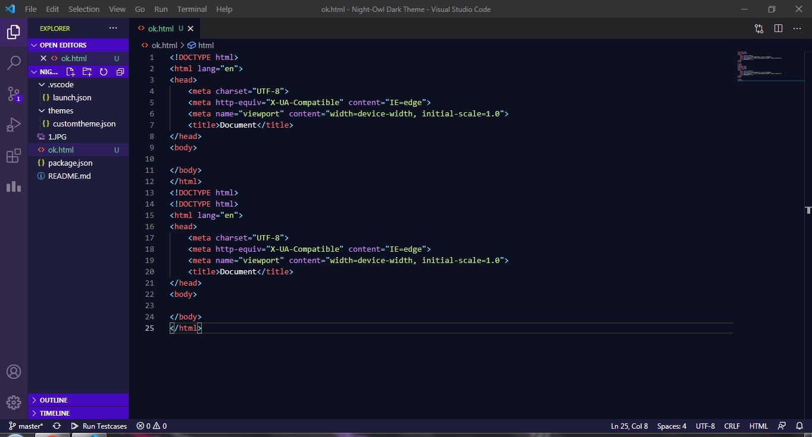

# Night_Owl-VS-Code-Dark-Theme

## How to install?

- Download the folder

- Paste the folder in your default : C:\Users\"Your username"\.vscode\extensions

- Open VS Code

- Click on File->Preferences-> Color Theme

- Select the Night Owl Theme


ScreenShots:




😄
```diff
Give a Star if You liked This Theme
@@ Feel free  to contact us for PRs and Improvements in this Theme. @@ 
